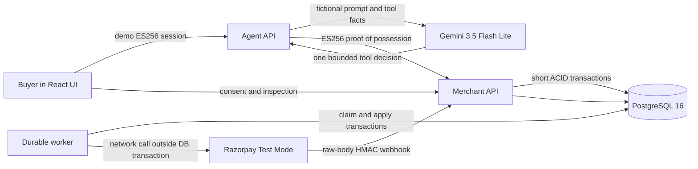
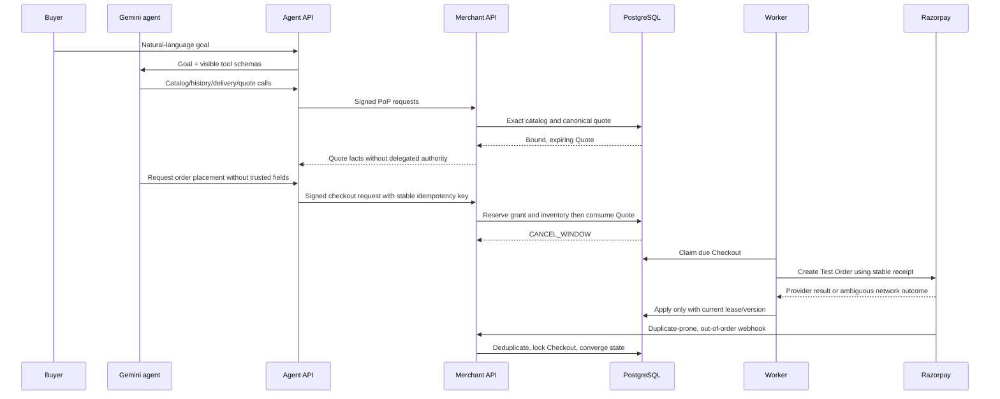

# AgentAuth architecture

AgentAuth is a merchant-side authorization and checkout gateway for AI buyers. It is inspired by
the trust problem UAP describes, but it does not claim NPCI UAP compliance or autonomous UPI
access. The central design rule is that the model may propose intent while deterministic services
own every money-relevant fact and transition.

## Trust boundaries

| Boundary | Credential | What it proves | What it does not prove |
|---|---|---|---|
| Buyer → application | 30-minute ES256 demo token | Consent by the seeded demo identity | Bank identity, device possession or biometrics |
| Agent API → Merchant API | P-256 request PoP | The exact request came from the registered agent key and is fresh | That the model made a good choice |
| Grant | User-approved immutable digest | Agent, merchant, categories, caps, validity and execution scope | Availability or payment success |
| Razorpay → webhook endpoint | HMAC-SHA256 over raw bytes | Payload came from the configured webhook secret | Event ordering or uniqueness |
| Worker observation → state | Checkout lock + lease token + version | The observation is still current when applied | That a failed attempt can never later capture |

The browser never receives the Gemini key, agent private key, Razorpay secret or webhook secret.
The agent service has the Gemini key and agent private key but no Razorpay credentials. The merchant
and worker have Razorpay credentials but no Gemini key or agent private key.

## Money path

## Why one agent

There is one semantic role: interpret a shopping goal and choose among five merchant tools. Splitting
that role into multiple agents would add handoffs, tokens and failure surfaces without introducing
an independent authority. The five tools are capabilities, not five prompts:

1. `search_catalog`
2. `get_usual_basket`
3. `get_delivery_options`
4. `quote_cart`
5. `place_order` or `request_purchase_approval`, structurally selected by grant policy

`place_order` is hidden until a successful Quote exists and accepts no quote ID, amount, grant ID or
idempotency key from the model. A changed cart invalidates the active Quote. The merchant revalidates
all context even if the agent runtime is compromised.

## Concurrency and recovery

- A conditional grant update serializes only the strict shared counter and cannot exceed the cap.
- Inventory rows are locked in ascending product-ID order.
- Checkout creation uses database-level `INSERT .. ON CONFLICT`, not SELECT-then-INSERT.
- No provider network request runs inside a database transaction.
- The worker uses `FOR UPDATE SKIP LOCKED` to claim batches and a token/version lease to apply an
  external observation.
- Webhook processing and worker application lock the same Checkout row.
- Failed payment attempts retain reservations; expiry requires a provider-confirmed unpaid result
  and grace period.
- A later capture after release becomes `LATE_CAPTURE_INCIDENT`, never silent fulfillment.
- Nonces use an UNLOGGED table and ten-minute bounded retention because five-minute-old proofs are
  already outside the acceptance window.

See [STATE_MACHINE.md](STATE_MACHINE.md) for transition ownership and [TOOL_DECISIONS.md](TOOL_DECISIONS.md)
for the explicit right-tool/right-place argument.
